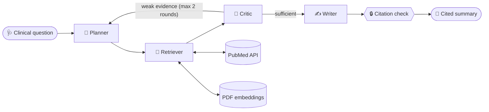

<div align="center">

# 🩺 Multi-Agent Clinical Research Assistant

### An AI research team that reads PubMed and your PDFs, checks its own evidence,<br>and writes clinical summaries with **verified citations**.

[🧠 How it works](#-how-it-works) ·
[📊 Results](#-results) ·
[🛡️ Safety](#%EF%B8%8F-safety-by-design)

</div>

> ⚠️ **Research / education tool only.** Not a medical device and not for clinical decision-making without expert review. Never upload patient data.

---

## 📸 Preview

<div align="center">

| Live agent tracker | Results dashboard |
|:---:|:---:|
|  |  |

</div>

---

## 💡 Why this project?

Finding and judging clinical evidence takes hours. General AI chatbots are fast, but they can **invent citations** and sound confident even when the evidence is weak or contradictory. In healthcare, that is unsafe.

This project fixes that with a **team of specialised AI agents** that cross-check each other, and a final **code-level citation check** that catches references the AI made up.

| ❌ Typical AI chatbot | ✅ This system |
|---|---|
| One model answers everything | Four agents, each with one job |
| Citations may be invented | Every citation checked against retrieved evidence |
| Same confidence for weak and strong evidence | A Critic grades evidence and loops back if it is weak |
| Answers from memory | Answers only from PubMed papers and your PDFs |
| Black box | Live agent tracker, plan, queries and sources visible |

---

## 🧠 How it works



### 🤖 Meet the agents

| Agent | Role | Model tier |
|---|---|---|
| 🧭 **Planner** | Turns the question into 3-4 focused PubMed search queries. In later rounds, it re-plans against the gaps the Critic found | Fast |
| 🔎 **Retriever** | A *tool-using* agent with two CrewAI tools: `pubmed_search` and `pdf_search` | Smart |
| 🧪 **Critic** | Scores evidence sufficiency (0 to 1), judges study type and recency, and lists gaps | Fast |
| ✍️ **Writer** | Writes a structured summary (Background, Key Findings, Evidence Quality, Clinical Considerations, References) using **only** the provided evidence | Smart |

After the Writer finishes, plain Python code verifies that **every cited ID exists in the retrieved evidence** and flags any that do not.

---

## ✨ Features

- 🤝 **Multi-agent collaboration** with a Critic-driven feedback loop
- 📖 **Live PubMed search** through the free NCBI E-utilities API
- 📚 **Your own PDF library**, searched by meaning with free local embeddings
- 🔒 **Citation verification** that flags any ID not found in the evidence
- 🏷️ **Evidence badges:** Meta-analysis · Systematic review · RCT · Review · Case report · PDF
- 📊 **Dashboard UI** with an animated agent tracker, a Critic score ring, metric cards and source cards
- ⬇️ **Downloadable summary** in Markdown
- 🆓 **Free stack** from end to end, deployed on Streamlit Community Cloud

---

## 🛡️ Safety by design

- **Evidence-only writing:** the Writer may use only the retrieved sources
- **No invented citations:** every ID is checked in code, not just by prompt
- **Honest uncertainty:** weak, limited or contradictory evidence must be stated
- **No patient-specific advice:** agents are instructed never to give personal medical advice
- **Visible disclaimer** in the app and in every downloaded summary
- **No patient data:** the UI warns users never to upload it

---

## 📚 How the PDF knowledge base works

<details>
<summary><b>Click to expand: embeddings explained simply</b></summary>

<br>

A computer cannot "understand" text, so a small AI model turns every piece of text into a **list of numbers (an embedding)**. Texts with similar *meaning* get similar numbers.

1. 📄 PDFs in `data/pdfs/` are read page by page
2. ✂️ The text is split into overlapping chunks (1000 characters, 150 overlap)
3. 🔢 A free local model (`BAAI/bge-small-en-v1.5` via `fastembed`) converts each chunk to a vector
4. 🔎 When an agent searches, the question is turned into a vector too, and the closest chunks are found by cosine similarity
5. 🏷️ Matches become evidence with IDs like `DOC1-12` and are cited exactly like PubMed IDs

No API key, no vector-database service, no cost.

</details>

---

## 🧰 Tech stack

| Layer | Tool |
|---|---|
| Agent framework | **CrewAI** (Agents, Tasks, Crews, custom tools) |
| LLM provider | **Groq** (GPT-OSS 120B and 20B) via LiteLLM |
| Evidence source 1 | **PubMed** E-utilities (free) |
| Evidence source 2 | Your **PDFs** (`pypdf` + `fastembed` + NumPy) |
| Interface | **Streamlit** with custom CSS |
| Hosting | **Streamlit Community Cloud** + **GitHub** |

---

## 🗂️ Project structure

```
📦 clinical-research-agent
├── 🤖 agents/
│   ├── base.py          # shared CrewAI helpers (LLM, agents, tasks, JSON parsing)
│   ├── planner.py       # Agent 1: question → search queries
│   ├── retriever.py     # Agent 2: PubMed + PDF tools
│   ├── critic.py        # Agent 3: evidence scoring + gaps
│   └── writer.py        # Agent 4: cited summary + citation check
├── 🛠️ tools/
│   ├── pubmed.py        # PubMed search
│   └── pdf_store.py     # PDF chunking, embeddings, semantic search
├── 🔁 graph/
│   └── pipeline.py      # orchestrates agents and the Critic loop
├── 📚 data/pdfs/        # open-access PDFs (internal library)
├── 🎨 app.py            # Streamlit UI
├── ⚙️ config.py         # models, limits, settings
└── 📄 requirements.txt
```

---

## ☁️ Deploy your own copy (browser only)

<details>
<summary><b>Click to expand: deploy in about 10 minutes</b></summary>

<br>

1. **Fork or copy** this repository to your GitHub account
2. Get a free API key at [console.groq.com](https://console.groq.com) → *API Keys*
3. Go to [share.streamlit.io](https://share.streamlit.io) → **Create app → Deploy a public app from GitHub**
4. Pick your repo, branch `main`, main file `app.py`
5. Under **Advanced settings** choose **Python 3.11** and paste your secrets:
```toml
   GROQ_API_KEY = "gsk_your_key_here"
   PUBMED_EMAIL = "your_email@example.com"
```
6. Click **Deploy**. The first start takes 5 to 10 minutes while packages install and PDFs are embedded.

To change the PDF library, add or remove files in `data/pdfs/` and reboot the app.

</details>

---

## 🧪 Try these questions

- *What is the current evidence for GLP-1 receptor agonists in patients with heart failure?*
- *Do SGLT2 inhibitors slow kidney disease progression in patients with type 2 diabetes?*
- *Does prone positioning reduce mortality in acute hypoxemic respiratory failure?*
- *Do GLP-1 agonists increase the risk of pancreatitis or thyroid cancer?*

---

## 📊 Results

Tested on 10 clinical questions:

| Metric | Result |
|---|---|
| 🎯 Average Critic score | **X.XX** |
| 🔒 Answers with all citations verified | **X / 10** |
| 📖 Average evidence items per answer | **XX** |
| ⏱️ Average response time | **XX seconds** |

---

## ⚠️ Limitations

- Uses PubMed **abstracts**, not full-text papers
- The Critic is an LLM judgement, not a formal risk-of-bias assessment
- The citation check confirms that a cited source exists in the evidence, not that it fully supports each sentence
- Free-tier API rate limits can slow responses
- Not validated for clinical use

## 🗺️ Roadmap

- [ ] 🕵️ **Verifier agent** that checks each claim against its source text
- [ ] 📄 Full-text retrieval from open-access PubMed Central articles
- [ ] 🌊 Streaming agent steps and saved research history
- [ ] 🧬 Study-design filters (RCTs only, last 5 years)

---

## 🙏 Acknowledgements

[CrewAI](https://www.crewai.com) · [Groq](https://groq.com) · [NCBI PubMed](https://pubmed.ncbi.nlm.nih.gov) · [fastembed](https://github.com/qdrant/fastembed) · [Streamlit](https://streamlit.io)

---

<div align="center">

**⚕️ For research and education only. This project does not provide medical advice.**

Made with ❤️ by **Jahangeer Ali** · [GitHub](https://github.com/JahangeerAli) · [LinkedIn](http://www.linkedin.com/in/jahangeer-ali-shilwa)

⭐ *If you find this useful, please star the repo!*

</div>
